<!-- Don't modify this line - it's the marker --> <table width="100%"> <tr> <td align="center" width="65%">  <br>  </td> <td align="center" width="35%">  </td> </tr> </table>

### 👨‍💻 whoami

```python
#!/usr/bin/env python3

class PenetrationTester:
    def __init__(self):
        self.name = "Anan Alim"
        self.role = "Aspiring Penetration Tester"
        self.education = "CS @ BRAC University"
        self.location = "Dhaka, Bangladesh 🇧🇩"
        self.level = "Beginner | Serious Learner"
        self.philosophy = "Slow but deep, Structured learner always, Builder mindset"
        self.favorite_quote = "Knowing yourself is the beginning of all wisdom. - Aristotle"
        
        self.certifications = {
            "in_progress": "eJPT (Aug 2026)",
            "planned": ["OSCP (Sept 2027)", "CRTO (Future)"],
            "earned": []  # Building the foundation first! 🎯
        }
        
        self.current_focus = [
            "TryHackMe: Jr Penetration Tester Path",
            "OverTheWire: Bandit Wargames",
            "Linux Internals & Networking Fundamentals",
            "Web Exploitation (OWASP Top 10)"
        ]
        
        self.long_term_goal = "OSCP → Red Team Operations"
        
    def get_learning_path(self):
        return {
            "methodology": "Structured → Document → Build",
            "platforms": ["TryHackMe", "OverTheWire", "HackTheBox"],
            "documentation": "Obsidian + Private Learning Repo",
            "output": "Writeups + Technical Notes"
        }
    
    def get_aesthetic(self):
        return "Purple Dark Tech | Red Team Energy | Minimal Clean"
    
    def say_hi(self):
        print("Thanks for visiting! Let's break and build together! 🛡️")

me = PenetrationTester()
me.say_hi()
```

---

### 🎯 Current Mission Status

```
[████████████░░░░░░░░░░░░] 50% → eJPT (Aug 2026)
[██████████░░░░░░░░░░░░░░] 40% → Jr Pentest Path
[████████░░░░░░░░░░░░░░░░] 30% → Bandit Wargames
[██████████████░░░░░░░░░░] 55% → Web Exploitation
[████░░░░░░░░░░░░░░░░░░░░] 15% → OSCP Prep (2027)
```

**🔴 LIVE STATUS:**

- 🎓 Learning: TryHackMe Jr Penetration Tester Path
- 🔧 Practicing: Web Application Security & Linux Internals
- 📚 Reading: OSCP Preparation Materials
- 💻 Building: Security Automation Tools & Scripts
- 📝 Documenting: Writeups in Obsidian

---

### 🏆 TryHackMe Journey

<div align="center"> <a href="https://tryhackme.com/p/ananalim" target="_blank">  </a> </div>

**🎯 My TryHackMe Path:**

- ✅ Pre Security Path - Complete
- ✅ Security 101 - Complete
- 🔄 Jr Penetration Tester Path - In Progress
- 🎖️ Focus: Web Fundamentals & Network Security
- 📍 Mindset: Slow but deep, every room documented

---

### 💻 Tech Arsenal & Tools

<!-- Operating Systems --> <div align="center">

**💀 Operating Systems**

  

**⚔️ Security Tools**

    

**🔨 Programming & Scripting**

   

**🛠️ Tools & Platforms**

   

</div>

---

### 📊 GitHub Statistics

<div align="center">   </div> <div align="center">   </div>

---

### 🐍 Contribution Snake

<div align="center"> <picture> <source media="(prefers-color-scheme: dark)" srcset="https://raw.githubusercontent.com/ananalim/ananalim/output/github-contribution-grid-snake-dark.svg"> <source media="(prefers-color-scheme: light)" srcset="https://raw.githubusercontent.com/ananalim/ananalim/output/github-contribution-grid-snake.svg">  </picture> </div>

---

### 🎯 2026-2028 Certification Roadmap



```mermaid
graph LR
    A[2026: Foundation Building] --> B[eJPT Aug 2026]
    B --> C[Web App Security Mastery]
    C --> D[2027: OSCP Preparation]
    D --> E[OSCP Sept 2027]
    E --> F[Red Team Specialization]
    F --> G[CRTO Certification]
    G --> H[Professional Red Team Role]
    
    style A fill:#1a1a1a,stroke:#9d00ff,stroke-width:2px,color:#fff
    style B fill:#1a1a1a,stroke:#ff0000,stroke-width:2px,color:#fff
    style C fill:#1a1a1a,stroke:#9d00ff,stroke-width:2px,color:#fff
    style D fill:#1a1a1a,stroke:#9d00ff,stroke-width:2px,color:#fff
    style E fill:#1a1a1a,stroke:#ff0000,stroke-width:3px,color:#fff
    style F fill:#1a1a1a,stroke:#9d00ff,stroke-width:2px,color:#fff
    style G fill:#1a1a1a,stroke:#ff0000,stroke-width:3px,color:#fff
    style H fill:#1a1a1a,stroke:#00ff00,stroke-width:4px,color:#fff
```

**📅 Detailed Timeline:**

<details> <summary>🔽 Click to expand full roadmap</summary>

#### 2026 - Foundation Year (Current)

- 🔄 Complete TryHackMe Jr Penetration Tester Path
- 🔄 Master OverTheWire Bandit Wargames
- 🔄 Web Exploitation Fundamentals (OWASP Top 10)
- 🎯 Achieve eJPT Certification (August 2026)
- 📝 Build Comprehensive Writeup Portfolio
- 💻 Develop Security Automation Scripts
- 🧠 Deep dive into Linux Internals & Networking

#### 2027 - OSCP Journey

- 🎯 Complete OSCP PWK Course & Labs (60+ boxes)
- 🎯 Active Directory Exploitation Mastery
- 🎯 Buffer Overflow & Privilege Escalation
- 🎯 Achieve OSCP Certification (September 2027)
- 🎯 Solve HackTheBox Medium/Hard Boxes
- 🎯 Start Contributing to Security Research
- 📚 Document Everything in Obsidian

#### 2028+ - Red Team Specialization

- 🚀 Complete University Capstone (Red Team Focus)
- 🚀 Achieve CRTO Certification
- 🚀 Advanced C2 Framework Development
- 🚀 Land First Red Team Position
- 🚀 Contribute to Open Source Security Tools
- 🚀 Active Bug Bounty Participation

</details>

---

### 📚 Learning Methodology

```
┌─────────────────────────────────────────────────────────────┐
│                                                             │
│  My Learning Philosophy: Slow but Deep                     │
│  ════════════════════════════════════════                  │
│                                                             │
│  1. 📖 Structured Learning                                 │
│     └─ Follow defined paths (THM, OverTheWire)            │
│                                                             │
│  2. 📝 Document Everything                                 │
│     └─ Obsidian notes + Writeups + Private repo           │
│                                                             │
│  3. 🔨 Builder Mindset                                     │
│     └─ Create tools, scripts, and automation              │
│                                                             │
│  4. 🎯 Deep Understanding                                  │
│     └─ Not just "how" but "why" it works                  │
│                                                             │
│  5. 🔄 Consistent Practice                                 │
│     └─ Daily progress over sporadic bursts                │
│                                                             │
└─────────────────────────────────────────────────────────────┘
```

---

### 🔬 Current Learning Path

```
┌──────────────────────────────────────────────────────────┐
│ Active Training Grounds (Week of Jan 2026)               │
├──────────────────────────────────────────────────────────┤
│                                                          │
│ 🔴 TryHackMe:                                           │
│    ├─ Pre Security Path ✅                              │
│    ├─ Security 101 ✅                                   │
│    └─ Jr Penetration Tester Path 🔄                     │
│                                                          │
│ 🔴 OverTheWire:                                         │
│    └─ Bandit Wargames (In Progress)                    │
│                                                          │
│ 🔴 Skill Development:                                   │
│    ├─ Linux Internals & Command Line                   │
│    ├─ Networking Fundamentals (TCP/IP, OSI)            │
│    └─ Web Exploitation Techniques                      │
│                                                          │
│ 📚 Study Materials:                                     │
│    ├─ OSCP Preparation Resources                       │
│    └─ Security Research Papers                         │
│                                                          │
│ 💻 Building:                                            │
│    ├─ Python Security Scripts                          │
│    └─ BASH Automation Tools                            │
│                                                          │
└──────────────────────────────────────────────────────────┘
```

---

### 🎓 Certifications Journey

<div align="center">

|Certification|Status|Target Date|Progress|
|---|---|---|---|
|**eJPT**|🔄 In Progress|Aug 2026||
|**OSCP**|🎯 Planned|Sept 2027||
|**CRTO**|🎯 Future|TBD 2028+||

</div>

---

### 🌐 Connect With Me

<div align="center"> <!-- LinkedIn - Coming Soon --> <a href="#" target="_blank">  </a> <!-- Blog - Coming Soon --> <a href="#" target="_blank">  </a> <!-- TryHackMe --> <a href="https://tryhackme.com/p/ananalim" target="_blank">  </a> <!-- Discord --> <a href="#" target="_blank">  </a> <!-- Email --> <a href="mailto:ananalim@example.com" target="_blank">  </a> </div>

---

### 💭 Philosophy & Mindset

```
┌─────────────────────────────────────────────────────────────┐
│                                                             │
│  "Knowing yourself is the beginning of all wisdom."        │
│                                         ― Aristotle         │
│                                                             │
│  "In cybersecurity, you're only as good as your            │
│   last vulnerability you didn't find."                     │
│                                                             │
│  My Principles:                                            │
│  ═════════════                                             │
│                                                             │
│  • Slow but Deep  →  Quality over Speed                    │
│  • Document Always  →  Knowledge Compounds                 │
│  • Build to Learn  →  Theory meets Practice                │
│  • Stay Structured  →  Chaos is the Enemy                  │
│  • Think Critical  →  Question Everything                  │
│                                                             │
└─────────────────────────────────────────────────────────────┘
```

---

### ⚡ Quick Facts

<div align="center">

|Aspect|Details|
|---|---|
|💻 **Favorite OS**|Kali (VM/Work) • Ubuntu (Daily Driver)|
|🛠️ **Favorite Tools**|Burp Suite • Metasploit • Python|
|📝 **Documentation**|Obsidian • Markdown • Git|
|🎯 **2026 Goal**|eJPT + Deep Web Security Knowledge|
|🌱 **Currently Learning**|Web Exploitation • Linux Internals|
|🎨 **Aesthetic**|Purple Dark Tech • Minimal Clean|
|☕ **Fuel**|Focus • Consistency • Documentation|

</div>

---

### 🏅 GitHub Trophies

<div align="center">


</div>

---

### 🛡️ Security Training Platforms

<div align="center">

**🎯 Active Learning Platforms**

|Platform|Status|Focus Area|
|---|---|---|
|🟥 **TryHackMe**|🔥 Active|Jr Penetration Tester Path|
|🟩 **OverTheWire**|🔥 Active|Bandit Wargames|
|🟦 **HackTheBox**|📅 Planned|Post-eJPT Practice|
|🟪 **PortSwigger**|📅 Planned|Web Security Academy|

</div>

---

### 🎮 When I'm Not Learning Security...

```python
#!/usr/bin/env python3

interests = {
    "📝": "Documenting everything in Obsidian",
    "🔨": "Building security tools and scripts",
    "📖": "Reading security research and writeups",
    "🎯": "Planning long-term learning strategies",
    "💭": "Deep thinking about security concepts",
    "🤝": "Helping others in the community",
    "⚙️": "Optimizing my learning workflow"
}

mindset = "Serious Learner | Red Team Energy | Builder Mindset"

def life_philosophy():
    return {
        "approach": "Slow but deep",
        "style": "Structured learner always",
        "outcome": "Builder mindset",
        "goal": "OSCP → Red Team → Continuous Growth"
    }

print(f"Mindset: {mindset}")
for icon, activity in interests.items():
    print(f"{icon} {activity}")
```

---

### 📊 Weekly Focus Areas

```
┌──────────────────────────────────────────────────────────┐
│ Learning Focus (Rotating Weekly)                         │
├──────────────────────────────────────────────────────────┤
│                                                          │
│ Week 1: 🌐 Web Exploitation                            │
│         └─ OWASP Top 10, SQLi, XSS, CSRF               │
│                                                          │
│ Week 2: 🐧 Linux Fundamentals                          │
│         └─ File System, Permissions, Services          │
│                                                          │
│ Week 3: 🌍 Networking Deep Dive                        │
│         └─ TCP/IP, Protocols, Packet Analysis          │
│                                                          │
│ Week 4: 🔨 Tool Building & Scripting                   │
│         └─ Python, BASH automation                     │
│                                                          │
│ Every Day: 📝 Document, Review, Build                  │
│                                                          │
└──────────────────────────────────────────────────────────┘
```

---

### 🎯 Mission Statement

<div align="center">

```
╔══════════════════════════════════════════════════════════╗
║                                                          ║
║  Building deep expertise in Penetration Testing and     ║
║  Red Team Operations through structured learning,       ║
║  consistent practice, and comprehensive documentation.   ║
║                                                          ║
║  Approach: Slow but Deep | Structured Always           ║
║                                                          ║
║  Goal: OSCP → Red Team Professional by 2028+           ║
║                                                          ║
║  Current Phase: Foundation Building (2026)              ║
║                                                          ║
║  Philosophy: Quality > Quantity | Depth > Speed         ║
║                                                          ║
╚══════════════════════════════════════════════════════════╝
```

</div>

---

### 📬 Collaboration & Networking

I'm open to:

- 🤝 Collaborating on security projects and tools
- 💬 Discussing penetration testing methodologies
- 📚 Sharing knowledge and learning resources
- 🎯 CTF team collaborations
- 📝 Technical writeup reviews
- 🔍 Security research discussions

**Feel free to reach out if you share similar interests!** 👋

---

### 💡 Random Security Quote

<div align="center">


</div>

---


---

<div align="center">

**⭐ If you find my profile interesting, consider starring my repositories!**

**🔔 Follow me to track my cybersecurity journey from beginner to OSCP!**


**📅 Last Updated:** January 2026 | Journey in Progress

**🎯 "Hack the planet, but do it ethically and methodically."** 🛡️

**💜 Purple Dark Tech | Red Team Energy | Minimal Clean**


</div> <!-- Don't modify this line - it's the marker -->