<!-- Don't modify this line - it's the marker -->

<div align="center">

<!-- Animated Typing Header -->


<!-- Profile Views Counter -->


</div>

---

<!-- Hacking Animation -->


### 👨‍💻 whoami

```python
#!/usr/bin/env python3

class RedTeamOperator:
    def __init__(self):
        self.name = "Md Ananal Islam"
        self.role = "Aspiring Red Team Operator"
        self.education = "CS @ BRAC University"
        self.location = "Dhaka, Bangladesh 🇧🇩"
        self.certifications = {
            "planned": ["eJPT", "OSCP", "CRTO"],
            "earned": []  # Updating soon! 🎯
        }
        self.current_focus = [
            "TryHackMe Jr Penetration Tester Path",
            "OverTheWire Bandit",
            "Web Application Security",
            "Active Directory Exploitation"
        ]
    
    def get_goals(self):
        return {
            "2026": "eJPT + Web App Mastery",
            "2027": "OSCP + Red Team Skills",
            "2028": "CRTO + First Red Team Role"
        }
    
    def say_hi(self):
        print("Thanks for visiting! Let's connect! 🤝")

me = RedTeamOperator()
me.say_hi()
```

<br clear="right"/>

---

### 🎯 Current Mission

```
[████████████████████░░░░░░] 70% → OSCP 2027
[███████████████░░░░░░░░░░░] 60% → Jr Pentest Path
[█████████░░░░░░░░░░░░░░░░░] 40% → OverTheWire
[████████████████████████░░] 90% → Web Security
```

**🔴 LIVE STATUS:**
- 🎓 Learning: TryHackMe Jr Penetration Tester Path
- 🔧 Practicing: Web Application Security (OWASP Top 10)
- 📚 Reading: OSCP Preparation Materials
- 💻 Building: Security Automation Tools

---

### 🏆 TryHackMe Stats

<div align="center">

<!-- TryHackMe Badge - Auto Updates! -->


<!-- TryHackMe Stats Card -->
<a href="https://tryhackme.com/p/ananalim" target="_blank">
  
</a>

</div>

**🎯 My TryHackMe Journey:**
- ✅ Pre Security Path - Complete
- 🔄 Jr Penetration Tester - In Progress
- 📍 Current Room: [Update this manually in Obsidian]
- 🎖️ Rank: [Your current rank]

---

### 💻 Tech Stack & Arsenal

<!-- Operating Systems -->
<div align="center">

**💀 Operating Systems**


**⚔️ Security Tools**


**🔨 Programming & Scripting**


**🗃️ Databases & Web**


**🛠️ Tools & Platforms**


</div>

---

### 📊 GitHub Statistics

<div align="center">

<!-- GitHub Stats Card -->


<!-- GitHub Streak Stats -->


</div>

<div align="center">

<!-- Most Used Languages -->


<!-- Activity Graph -->


</div>

---

### 🐍 Contribution Snake

<!-- Snake eating contributions animation -->
<div align="center">
  <picture>
    <source media="(prefers-color-scheme: dark)" srcset="https://raw.githubusercontent.com/ananalim/ananalim/output/github-contribution-grid-snake-dark.svg">
    <source media="(prefers-color-scheme: light)" srcset="https://raw.githubusercontent.com/ananalim/ananalim/output/github-contribution-grid-snake.svg">
    
  </picture>
</div>

---

### 🎯 2026-2028 Roadmap



```mermaid
graph LR
    A[2026: Foundations] --> B[eJPT Certified]
    B --> C[2027: OSCP Journey]
    C --> D[OSCP Certified]
    D --> E[2028: Red Team]
    E --> F[CRTO Certified]
    F --> G[First Red Team Role]
    
    style A fill:#1a1a1a,stroke:#00ff00,stroke-width:2px,color:#fff
    style B fill:#1a1a1a,stroke:#ff0000,stroke-width:2px,color:#fff
    style C fill:#1a1a1a,stroke:#00ff00,stroke-width:2px,color:#fff
    style D fill:#1a1a1a,stroke:#ff0000,stroke-width:2px,color:#fff
    style E fill:#1a1a1a,stroke:#00ff00,stroke-width:2px,color:#fff
    style F fill:#1a1a1a,stroke:#ff0000,stroke-width:2px,color:#fff
    style G fill:#1a1a1a,stroke:#00ff00,stroke-width:4px,color:#fff
```

**📅 Detailed Timeline:**

<details>
<summary>🔽 Click to expand full roadmap</summary>

#### 2026 - Foundation Year
- ✅ Complete TryHackMe Jr Penetration Tester Path
- ✅ Master OWASP Top 10
- ✅ Achieve eJPT Certification
- ✅ Solve 10+ HackTheBox Easy Boxes
- ✅ Build Web Security Portfolio

#### 2027 - OSCP Year
- 🎯 Complete OSCP PWK Labs (60+ boxes)
- 🎯 Active Directory Mastery
- 🎯 Achieve OSCP Certification
- 🎯 Solve 25+ HackTheBox Medium Boxes
- 🎯 Start Bug Bounty Hunting

#### 2028 - Red Team Year
- 🚀 Complete Final Year Red Team Project
- 🚀 Achieve CRTO Certification
- 🚀 Advanced C2 Framework Skills
- 🚀 Land First Red Team Role
- 🚀 Active in Bug Bounty Programs

</details>

---

### 📚 Latest Projects

<div align="center">

<!-- Pinned Repository Cards -->
<a href="https://github.com/ananalim/Cybersecurity-learning">
  
</a>

<!-- Add more project cards as you create them -->

</div>

**🔨 Current Focus:**
- 🛠️ Building security automation scripts
- 📝 Documenting CTF writeups (after box retirement)
- 🔍 Researching Active Directory attack techniques
- 💻 Developing web vulnerability scanners

---

### 📝 Latest Blog Posts

<!-- BLOG-POST-LIST:START -->
<!-- This section will be populated when you start blogging -->

**📰 Coming Soon on Medium:**
- 🔜 "My First Month in Cybersecurity" 
- 🔜 "OverTheWire Bandit: Complete Walkthrough"
- 🔜 "Understanding SQL Injection for Beginners"
- 🔜 "How I'm Preparing for OSCP"

<!-- Placeholder for Medium badge -->
<div align="center">

[](https://medium.com/@ananalim)
<!-- Update the link when you create your Medium account -->

</div>

<!-- BLOG-POST-LIST:END -->

---

### 🤝 Connect With Me

<div align="center">

<!-- LinkedIn - Update when created -->
<a href="https://linkedin.com/in/ananalim" target="_blank">
  
</a>

<!-- Facebook -->
<a href="https://www.facebook.com/mdananalim" target="_blank">
  
</a>

<!-- Instagram -->
<a href="https://instagram.com/phychoxgoner" target="_blank">
  
</a>

<!-- TryHackMe -->
<a href="https://tryhackme.com/p/ananalim" target="_blank">
  
</a>

<!-- HackTheBox - Update with your profile when active -->
<a href="https://app.hackthebox.com/profile/ananalim" target="_blank">
  
</a>

<!-- Medium - Update when created -->
<a href="https://medium.com/@ananalim" target="_blank">
  
</a>

<!-- Email -->
<a href="mailto:ananalim@example.com" target="_blank">
  
</a>

</div>

---

### 🎓 Certifications Journey

<div align="center">

| Certification | Status | Target Date | Badge |
|--------------|--------|-------------|-------|
| eJPT | 🎯 Planned | Aug 2026 |  |
| OSCP | 🎯 Planned | Aug 2027 |  |
| CRTO | 🎯 Planned | May 2028 |  |

</div>

---

### 💭 Random Dev Quote

<div align="center">


</div>

---

### 🏅 GitHub Trophies

<div align="center">


</div>

---

### 📈 Contribution Calendar

<!--START_SECTION:activity-->
<!-- GitHub Activity will appear here automatically -->
<!--END_SECTION:activity-->

---

### 💡 Fun Facts & Philosophy

```
┌─────────────────────────────────────────────────────────────┐
│                                                             │
│  "The best way to predict the future is to create it."     │
│                                    - Abraham Lincoln        │
│                                                             │
│  "Hacking is not about breaking things,                    │
│   it's about understanding how they work."                 │
│                                    - Anonymous              │
│                                                             │
│  My Mantra: Consistency > Intensity                        │
│             Document > Forget                              │
│             Persistence > Perfection                       │
│                                                             │
└─────────────────────────────────────────────────────────────┘
```

**⚡ Quick Facts:**
- 🔥 Current Streak: [Update manually] days of coding
- 💻 Favorite Tool: Burp Suite & Python
- 🎯 2026 Goal: eJPT + 100 CTF boxes
- 🌱 Currently Learning: Active Directory Exploitation
- 🎨 Fun Fact: I use Obsidian for everything!
- ☕ Fuel: Coffee + Electronic Music

---

### 🎯 Current Learning Path

```
┌──────────────────────────────────────────────────────────┐
│ Active Learning (Week of [Update Date])                  │
├──────────────────────────────────────────────────────────┤
│                                                          │
│ 🔴 TryHackMe:                                           │
│    └─ Jr Penetration Tester Path (60% Complete)        │
│                                                          │
│ 🔴 OverTheWire:                                         │
│    └─ Bandit (Currently at Level: [Update])            │
│                                                          │
│ 🔴 PortSwigger Academy:                                 │
│    └─ SQL Injection Labs (In Progress)                 │
│                                                          │
│ 🔴 HackTheBox:                                          │
│    └─ Easy Boxes (X/10 Completed)                      │
│                                                          │
│ 📚 Reading:                                             │
│    └─ OSCP Preparation Materials                       │
│                                                          │
└──────────────────────────────────────────────────────────┘
```

---

### 🛡️ CTF Achievements

<div align="center">

**🚩 CTF Stats (Updated: [Date])**

| Platform | Boxes Solved | Current Rank | Points |
|----------|--------------|--------------|--------|
| TryHackMe | [X] Rooms | [Rank] | [Points] |
| HackTheBox | [X] Boxes | [Rank] | [Points] |
| OverTheWire | Bandit L[X] | - | - |

</div>

---

### 📣 Latest GitHub Activity

<!--START_SECTION:activity-->
1. 🎯 Pushed to repository [repo-name]
2. ⭐ Starred [repo-name]
3. 🔱 Forked [repo-name]
4. 💬 Commented on issue in [repo-name]
5. 🎉 Created new repository [repo-name]
<!--END_SECTION:activity-->

---

### 🎮 When I'm Not Hacking...

```python
hobbies = {
    "🎵": "Listening to electronic music while coding",
    "📖": "Reading cybersecurity blogs and research papers",
    "🎮": "Playing CTF challenges for fun",
    "✍️": "Writing blog posts about my journey",
    "🤝": "Helping others learn cybersecurity",
    "☕": "Brewing the perfect cup of coffee"
}

for hobby, description in hobbies.items():
    print(f"{hobby} {description}")
```

---

### 🔥 Contribution Heatmap

<div align="center">

<!-- Isometric Contribution Calendar -->


</div>

---

<div align="center">

### 🎯 Mission Statement

```
╔══════════════════════════════════════════════════════════╗
║                                                          ║
║  Building expertise in Red Team Operations through       ║
║  consistent practice, documentation, and persistence.    ║
║                                                          ║
║  Goal: Become a professional Red Team Operator by 2028  ║
║                                                          ║
║  Current Phase: Foundation Building (2026)              ║
║                                                          ║
╚══════════════════════════════════════════════════════════╝
```

---

### 📬 Let's Collaborate!

I'm always open to:
- 🤝 Collaborating on security projects
- 💬 Discussing cybersecurity topics
- 📚 Sharing knowledge and learning together
- 🎯 CTF team-ups
- 🔍 Bug bounty hunting partnerships

**Feel free to reach out!** 👋

---


---

**⭐ If you find my profile interesting, consider leaving a star on my repositories!**

**🔔 Follow me to stay updated with my cybersecurity journey!**

---

<div align="center">


**📅 Last Updated:** [Auto-updates via GitHub Actions]

**🎯 "Hack the planet, but do it ethically."** 🛡️


</div>

<!-- Don't modify this line - it's the marker -->