<div align="center"> <!-- Animated Terminal Header -->  </div> <p align="center">    </p> <div align="center">

```ascii
╔═══════════════════════════════════════════════════════════╗
║                                                           ║
║   "Knowing yourself is the beginning of all wisdom."     ║
║                                    — Aristotle            ║
║                                                           ║
╚═══════════════════════════════════════════════════════════╝
```

</div>

---


###  **About Me**

```js
const anan = {
    role: "Aspiring Penetration Tester",
    education: "CS @ BRAC University",
    currentFocus: "Jr. Penetration Tester Path",
    philosophy: "Slow but deep. Structured learner always.",
    mindset: "Builder",
    
    longTermGoal: {
        certifications: ["eJPT (Aug 2026)", "OSCP (Sept 2027)", "CRTO"],
        career: "Red Team Operations"
    },
    
    favoriteOS: {
        work: "Kali Linux",
        daily: "Ubuntu"
    }
};
```

<br clear="right"/>

---

### 🎯 **Learning Trajectory**

<div align="center">



</div>

```mermaid
graph LR
    A[Pre-Security] --> B[Security 101]
    B --> C[Jr. Penetration Tester]
    C --> D[eJPT - Aug 2026]
    D --> E[OSCP - Sept 2027]
    E --> F[CRTO]
    F --> G[Red Team Operator]
    
    style A fill:#1a1a1a,stroke:#00ff00,stroke-width:2px,color:#00ff00
    style B fill:#1a1a1a,stroke:#00ff00,stroke-width:2px,color:#00ff00
    style C fill:#1a1a1a,stroke:#ffa500,stroke-width:2px,color:#ffa500
    style D fill:#1a1a1a,stroke:#dc143c,stroke-width:2px,color:#dc143c
    style E fill:#1a1a1a,stroke:#dc143c,stroke-width:2px,color:#dc143c
    style F fill:#1a1a1a,stroke:#dc143c,stroke-width:2px,color:#dc143c
    style G fill:#1a1a1a,stroke:#dc143c,stroke-width:3px,color:#dc143c
```

**Completed Modules**

- ✅ TryHackMe: Pre-Security & Security 101
- ✅ Bandit Wargames (OverTheWire)
- ✅ Linux Internals & Networking Fundamentals
- ✅ Web Exploitation Basics

**Currently Learning**

- 🔴 TryHackMe Jr. Penetration Tester Path
- 🔴 eJPT Certification Preparation

---

### ⚔️ **Arsenal**

<table width="100%"> <tr> <td valign="top" width="50%">

#### 🐧 **Systems & Environments**

<p align="left">    </p>

#### 🔴 **Offensive Tools**

<p align="left">      </p> </td> <td valign="top" width="50%">

#### 💻 **Programming & Scripting**

<p align="left">     </p>

#### 🛠️ **Development Tools**

<p align="left">    </p> </td> </tr> </table>

---

### 📊 **Activity**

<div align="center">   </div> <div align="center">  </div>

---

### 🔗 **Connect**

<div align="center">

[](https://tryhackme.com/p/ananalim) [](https://github.com/ananalim) [](https://claude.ai/chat/113e4fa8-ed4b-4079-9882-e0bab0c4d3ac#)

**LinkedIn** • **Blog** — _Coming Soon_

</div>

---

<div align="center">

### 💭 **Learning Philosophy**

```python
while True:
    learn("slow but deep")
    document("in obsidian")
    build("with intention")
    repeat()
    
# Student today. Red teamer tomorrow.
```

 </div>

---

<div align="center">  </div>