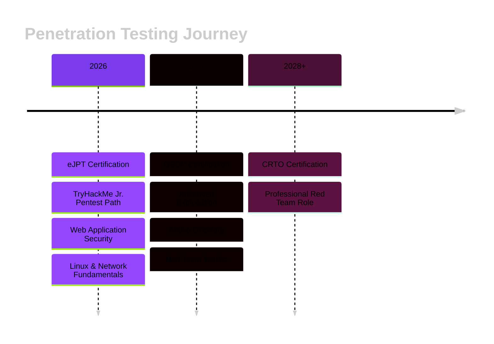

<div align="center"> <!-- Animated Header -->  <br>  </div>

---

### `$ whoami`

```python
#!/usr/bin/env python3

class PenetrationTester:
    def __init__(self):
        self.name = "Anan Alim"
        self.role = "Penetration Tester"
        self.education = "CS @ BRAC University"
        self.location = "Dhaka, Bangladesh"
        self.mindset = "Serious Learner | Red Team Energy"
        
    def certifications(self):
        return {
            "pursuing": "eJPT (Aug 2026)",
            "planned": ["OSCP (Sept 2027)", "CRTO"]
        }
    
    def learning_path(self):
        return [
            "TryHackMe: Jr. Penetration Tester",
            "OverTheWire: Bandit Wargames",
            "Web Exploitation & Linux Internals",
            "Active Directory & Network Fundamentals"
        ]
    
    def philosophy(self):
        return {
            "approach": "Slow but deep | Structured learner",
            "mindset": "Builder mindset | Document everything",
            "tools": "Obsidian notes + Private repo writeups"
        }

# Initialize
operator = PenetrationTester()
print("Knowing yourself is the beginning of all wisdom. — Aristotle")
```

---

### `$ cat tech_stack.txt`

<div align="center">

**Operating Systems**

  

**Security Arsenal**

    

**Languages & Scripting**

   

**Development Tools**

  

</div>

---

### `$ cat roadmap.md`



---

### `$ github --stats`

<div align="center">   </div> <div align="center">  </div>

---

### `$ ls -la /dev/social`

<div align="center">

[](https://github.com/ananalim) [](https://tryhackme.com/p/ananalim) [](https://discord.com/)

<!-- Coming Soon -->

 

</div>

---

### `$ snake --contribution-graph`

<div align="center"> <picture> <source media="(prefers-color-scheme: dark)" srcset="https://raw.githubusercontent.com/ananalim/ananalim/output/github-contribution-grid-snake-dark.svg"> <source media="(prefers-color-scheme: light)" srcset="https://raw.githubusercontent.com/ananalim/ananalim/output/github-contribution-grid-snake.svg">  </picture> </div>

---

<div align="center">

**Long-term goal: OSCP → Red Team Professional**

_Favorite OS: Kali for pentesting | Ubuntu for daily driver_

<sub>📝 Documented with Obsidian | Built with consistency</sub>

 </div>