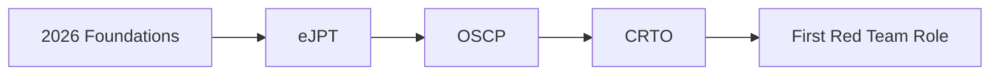

<!-- Don't modify this line - it's the marker -->

<div align="center">


</div>

---

<table>
<tr>
<td width="60%">

### 👨‍💻 whoami

```python
#!/usr/bin/env python3

class RedTeamOperator:
    def __init__(self):
        self.name = "Md Ananal Islam"
        self.role = "Aspiring Red Team Operator"
        self.education = "CS @ BRAC University"
        self.location = "Dhaka, Bangladesh 🇧🇩"
        self.certifications = {
            "planned": ["eJPT", "OSCP", "CRTO"],
            "earned": []
        }
        self.current_focus = [
            "TryHackMe Jr Penetration Tester Path",
            "OverTheWire Bandit",
            "Web Application Security",
            "Active Directory Exploitation"
        ]

    def get_goals(self):
        return {
            "2026": "eJPT + Web App Mastery",
            "2027": "OSCP + Red Team Skills",
            "2028": "CRTO + First Red Team Role"
        }

    def say_hi(self):
        print("Thanks for visiting! Let's connect! 🤝")

me = RedTeamOperator()
me.say_hi()
```

</td>

<td width="40%" align="center">


</td>
</tr>
</table>

---

### 🎯 Current Mission

```
[████████████████████░░░░░░] 70% → OSCP 2027
[███████████████░░░░░░░░░░░] 60% → Jr Pentest Path
[█████████░░░░░░░░░░░░░░░░░] 40% → OverTheWire
[████████████████████████░░] 90% → Web Security
```

---

### 🏆 TryHackMe Stats

<div align="center">


<a href="https://tryhackme.com/p/ananalim">

</a>

</div>

---

### 💻 Tech Stack & Arsenal

<div align="center">


</div>

---

### 📊 GitHub Statistics

<table align="center">
<tr>
<td>


</td>
<td>


</td>
</tr>
</table>

<div align="center">


</div>

---

### 🐍 Contribution Snake

<div align="center">

<picture>
  <source media="(prefers-color-scheme: dark)" srcset="https://raw.githubusercontent.com/ananalim/ananalim/output/github-contribution-grid-snake-dark.svg">
  
</picture>

</div>

---

### 🎯 2026–2028 Roadmap



---

### 📚 Latest Project

<div align="center">

<a href="https://github.com/ananalim/Cybersecurity-learning">

</a>

</div>

---

<div align="center">


**Hack the planet — ethically. 🛡️**

</div>

<!-- Don't modify this line - it's the marker -->
