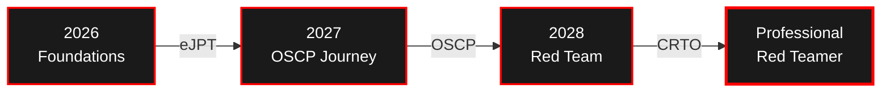

<div align="center"> <!-- Animated Typing Header -->  <br/> <!-- Profile Views Counter --> 

<br/><br/>

<!-- Glitch/Cyber GIF -->  </div>

---

### `$ whoami`

```python
#!/usr/bin/env python3

class PenetrationTester:
    def __init__(self):
        self.name = "Anan Alim"
        self.role = "Aspiring Penetration Tester"
        self.education = "CS @ BRAC University"
        self.location = "Dhaka, Bangladesh"
        self.mindset = "Red Team Energy"
        
    def current_path(self):
        return {
            "learning": [
                "TryHackMe Jr Penetration Tester Path",
                "OverTheWire Bandit Wargames",
                "Linux Internals & Networking",
                "Web Application Security"
            ],
            "certifications": {
                "targeting": "eJPT (Aug 2026)",
                "future": ["OSCP (Sept 2027)", "CRTO"]
            }
        }
    
    def philosophy(self):
        return "Slow but deep. Structured learner. Builder mindset."

operator = PenetrationTester()
print("Thanks for dropping by. Let's connect! 🤝")
```

---

### `$ cat quote.txt`

<div align="center">

```
┌─────────────────────────────────────────────────────────────┐
│                                                             │
│  "Knowing yourself is the beginning of all wisdom."        │
│                                        ― Aristotle          │
│                                                             │
└─────────────────────────────────────────────────────────────┘
```

</div>

---

### 🎯 Roadmap



---

### 💻 Arsenal

<div align="center">

**⚡ Operating Systems**

  

**🔴 Security Tools**

    

**⚙️ Languages & Scripting**

   

**🛠️ Tools & Workflow**

  

</div>

---

### 📊 GitHub Stats

<div align="center">   </div> <div align="center">  </div>

---

### 🐍 Contribution Graph

<div align="center"> <picture> <source media="(prefers-color-scheme: dark)" srcset="https://raw.githubusercontent.com/ananalim/ananalim/output/github-contribution-grid-snake-dark.svg"> <source media="(prefers-color-scheme: light)" srcset="https://raw.githubusercontent.com/ananalim/ananalim/output/github-contribution-grid-snake.svg">  </picture> </div>

---

### 🔗 Connect

<div align="center">

[](https://tryhackme.com/p/ananalim) [](https://discord.com/) [](https://claude.ai/chat/8b340d1a-08e4-4c7f-9189-a3cb07765780#) [](https://claude.ai/chat/8b340d1a-08e4-4c7f-9189-a3cb07765780#)

</div>

---

<div align="center"> 

**⚡ "Slow but deep. Every exploit documented. Every vulnerability understood."**

</div>